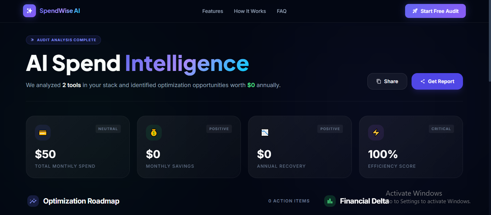
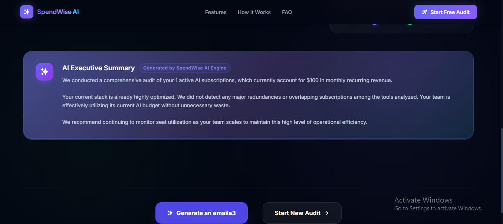

# SpendWise AI — Optimize Your AI Stack

**SpendWise AI** is a professional-grade audit tool designed to help startups and engineering teams identify redundant AI subscriptions, optimize seat utilization, and slash their monthly burn rate.

### 🔗 Live Demo: [https://spend-wise-seven-lovat.vercel.app/](https://spend-wise-seven-lovat.vercel.app/)





## 🚀 Overview

In the era of "AI-first" development, teams often find themselves paying for overlapping tools: ChatGPT Plus, Claude Pro, GitHub Copilot, and various API credits simultaneously. SpendWise AI analyzes your current stack and provides a data-driven optimization report in under 2 minutes.

### Key Features
- **Deterministic Audit Engine**: Precision-built logic to identify tool overlaps (e.g., ChatGPT vs. Claude) and seat-count redundancies.
- **AI-Powered Executive Summary**: Generates a professional narrative summary of your savings using Hugging Face's LLM inference.
- **Interactive Results Dashboard**: Beautiful, high-fidelity visualizations of your spend vs. projected savings.
- **Email Report Integration**: Receive a detailed breakdown of your audit results directly in your inbox.
- **PLG Viral Loop**: Shareable audit results to demonstrate savings to stakeholders.

## 🛠️ Tech Stack

### Frontend
- **Framework**: React 18 with Vite
- **Language**: TypeScript
- **Styling**: Tailwind CSS
- **Icons**: Lucide React
- **Animations**: Framer Motion
- **Charts**: Recharts

### Backend
- **Framework**: FastAPI (Python 3.10+)
- **Database**: MongoDB (via Motor async driver)
- **AI Integration**: Hugging Face Inference API (`google/gemma-2b-it`)
- **Email Service**: SendGrid
- **Validation**: Pydantic v2

## 📦 Getting Started

### Prerequisites
- Node.js (v18+)
- Python (v3.10+)
- MongoDB (Local or Atlas)
- Hugging Face API Key
- SendGrid API Key (Optional for email functionality)

### Installation

1. **Clone the repository**
   ```bash
   git clone https://github.com/your-username/spendwise.git
   cd spendwise
   ```

2. **Backend Setup**
   ```bash
   cd backend
   python -m venv venv
   source venv/bin/activate  # On Windows: venv\Scripts\activate
   pip install -r requirements.txt
   ```
   Create a `.env` file in the `backend` directory:
   ```env
   MONGODB_URL=your_mongodb_connection_string
   HUGGINGFACE_API_KEY=your_hf_key
   SENDGRID_API_KEY=your_sendgrid_key
   FROM_EMAIL=your_verified_sender@email.com
   ```

3. **Frontend Setup**
   ```bash
   cd ../frontend
   npm install
   ```
   Create a `.env` file in the `frontend` directory:
   ```env
   VITE_API_URL=http://localhost:8000
   ```

### Running the App

- **Start Backend**: `cd backend && uvicorn main:app --reload`
- **Start Frontend**: `cd frontend && npm run dev`

## 📖 Documentation
- [Architecture Details](ARCHITECTURE.md)
- [Pricing Data Sources](PRICING_DATA.md)
- [Unit Economics](ECONOMICS.md)
- [Go-To-Market Strategy](GTM.md)

## 📄 License
MIT License - see [LICENSE](LICENSE) for details.
